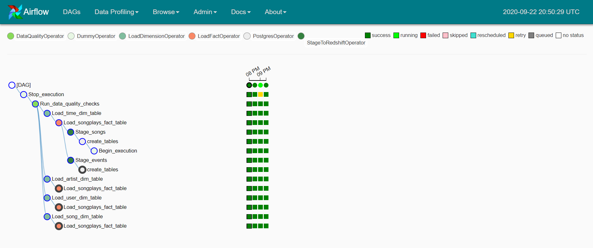
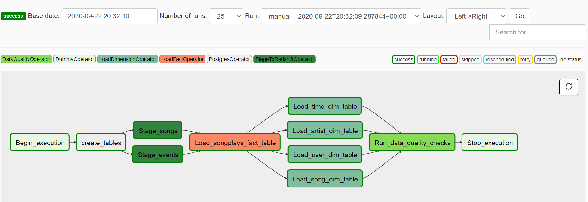

# Airflow Data Pipeline Project in Sparkify

Project 5: Data Pipeline 

# Project Overview

The learning outcome of this project is about how to use Apache Airflow to run automation under a regular basis, including instant time to time, hourly, daily, weekly, monthly or yearly. The basis of running an Airflow are highly referred from running an ETL pipeline first to deliver the data through AWS cloud, and re-structral the data precisely which enable the data analyst the run the analysis more effectively. 

As mentioned briefly, the song and log data under JSON format were loaded from Udacity publicly accessible S3 bucket via ETL, and processes the data under a star schema into the AWS Redshift. 

